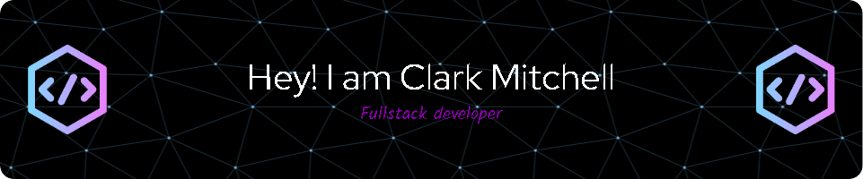

<h1>Hi, I'm Clark!  <a href="https://github.com/cmitch30">Programmer</a>, <a href="https://www.linkedin.com/in/clarkjmitchell/">Cybersecurity Professional</a>
- 💻 I am a front-end web developer with skills in CSS, HTML, and JavaScript.
- 🎮 Avid gamer with a passion for both console and pc gaming.
- 🤖 Robotics enthusiast building Arduino projects in my spare time.
- ❤️ I love React, and building fun experiments.

<h2>👨‍💻 Software Development Projects:</h2>

- <b>Data Structures and Algorithms Practice (AlgoExpert)</b>
  - [Praciting DS & Algos in Python](https://github.com/joshmadakor1/Algorithms-Practice)
- <b>Full Stack Web App (React, NodeJS, Azure, and Machine Learning Components)</b>
  - [Image Analysis Middleware](https://github.com/joshmadakor1/4chan-Image-Analysis-Middleware-C964) <b><i>(Potentially NSFW)</b></i>
- <b>PowerShell</b>
  - [Windows EventLog: Failed RDP Logins Source IP to full GeoData Conversion](https://github.com/cmitch30/siemlab)
  - [JWipe (Disk Wiping Utility)](https://github.com/joshmadakor1/Jwipe.PowerShell)
  - [Active Directory Bulk User Creation](https://github.com/joshmadakor1/AD_PS)
  - [FIM (File Integrity Monitor)](https://github.com/joshmadakor1/PowerShell-Integrity-FIM)
- <b>C# (.NET Desktop Applications)</b>
  - [Ransomware Proof of Concept (Encrypter)](https://github.com/joshmadakor1/EncrypterPOC)
  - [Ransomware Proof of Concept (Decrypter)](https://github.com/joshmadakor1/DecrypterPOC)
  - [Keylogger with Email Capability](https://github.com/joshmadakor1/Key-Logger-With-Email)
- <b>Python</b>
  - [Package Delivery Application (Datastructures and Algorithms Demo)](https://github.com/joshmadakor1/Package-Delivery-Pathfinding-Algorithm)

<h2>👨‍💻 Cybersecurity Projects:</h2>
- [Active Directory Home Lab](https://github.com/cmitch30/activelab)

<h2> 🤳 Connect with me:</h2>
<!-- [][youtube]
[][twitter] -->
[][linkedin]
[][instagram]

[instagram]: https://www.instagram.com/mitchc06/
[linkedin]: https://linkedin.com/in/clarkjmitchell

<!--
- 🔭 I’m currently working on ...
- 🌱 I’m currently learning ...
- 👯 I’m looking to collaborate on ...
- 🤔 I’m looking for help with ...
- 💬 Ask me about ...
- 📫 How to reach me: ...
- 😄 Pronouns: ...
- ⚡ Fun fact: ...
-->

<code></code>
<code></code>
<code></code>
<code></code>
<code></code>
<code></code>

<!-- 

 -->

# Interested in Learning:

# Hobbies include: 

